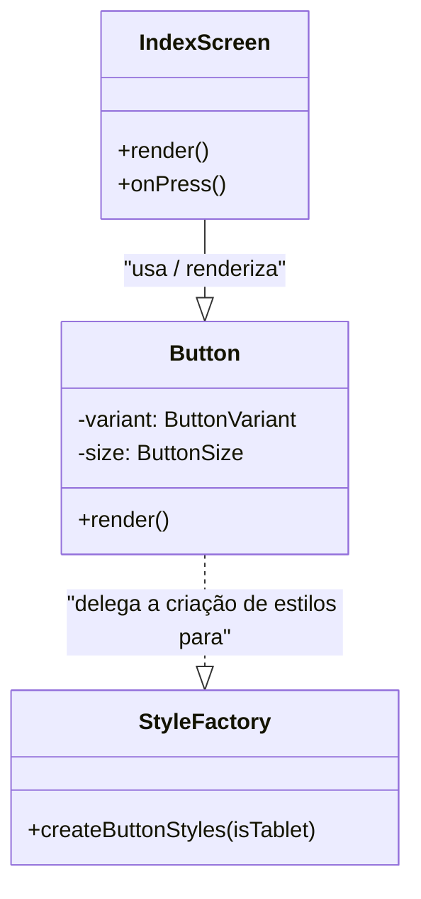

# 🏗️ Arquitetura com Design Patterns em React Native

Este repositório documenta a aplicação de um **Design Pattern** na arquitetura de um aplicativo mobile moderno, construído com **React Native, Expo e TypeScript**. O foco principal é a implementação do padrão **Factory Method** para desacoplar e escalar a criação de componentes de UI.

---

## 📌 Introdução aos Design Patterns

**Design Patterns** (Padrões de Projeto) são soluções arquiteturais testadas e aprovadas para problemas recorrentes no ciclo de vida do desenvolvimento de software. Sua aplicação resulta em um código mais coeso, legível e de fácil manutenção. Em vez de reinventar a roda, os padrões nos oferecem um vocabulário comum e moldes de soluções que podem ser adaptados a diferentes contextos.

### As Três Categorias Principais

Os padrões de projeto são classicamente divididos em três categorias, baseadas em seu propósito:

1.  **Criacionais**: Abstraem o processo de criação de objetos. Eles ajudam a tornar um sistema independente de como seus objetos são criados, compostos e representados. (Ex: *Factory Method*, *Singleton*, *Builder*).
2.  **Estruturais**: Lidam com a composição de classes e objetos para formar estruturas maiores. Eles simplificam a estrutura identificando relações simples entre entidades. (Ex: *Adapter*, *Decorator*, *Facade*).
3.  **Comportamentais**: Concentram-se em algoritmos e na atribuição de responsabilidades entre objetos, descrevendo não apenas estruturas, mas também padrões de comunicação entre eles. (Ex: *Observer*, *Strategy*, *Command*).

---

## 🎯 Padrão de Projeto Aplicado: Factory Method

### 🧱 Categoria

**Criacional**: Como vimos, este padrão foca em como os objetos são criados.

### ✅ Motivação

A necessidade de construir uma biblioteca de **componentes visuais reutilizáveis** — como botões com diferentes estilos (`primary`, `outline`) e dimensões (`small`, `large`) — motivou a escolha. O **Factory Method** nos permitiu centralizar a lógica de criação, evitando a duplicação de código e promovendo um sistema de design consistente.

### ⚖️ Benefícios e Trade-offs

-   **Benefícios**: O principal benefício foi o **baixo acoplamento**. O código que utiliza o botão (`IndexScreen`) não precisa saber como cada variante é construída. Isso aumenta a **coesão**, centralizando a lógica de estilos, e melhora a **manutenibilidade**, pois para criar um novo tipo de botão, basta modificar a fábrica, sem tocar nos componentes consumidores.
-   **Trade-offs**: A principal desvantagem é o aumento da **complexidade inicial**. Para um componente muito simples, criar uma fábrica pode ser um excesso de engenharia (*over-engineering*), adicionando mais arquivos e uma camada de abstração que pode dificultar o rastreamento para desenvolvedores menos experientes com o padrão.

---

## 🧩 Estrutura da Implementação

A solução foi estruturada em torno de um componente `Button` que delega a responsabilidade de criar seus estilos para uma função "fábrica" (`createButtonStyles`). Essa função utiliza as `props` `variant` e `size` como parâmetros para determinar qual variação de estilo deve ser retornada.

### Diagrama da Estrutura

O diagrama abaixo ilustra a relação entre o cliente (tela), o componente e a fábrica de estilos.



### 🗂️ Arquivos Principais

-   `components/Button.tsx`: O componente que serve como interface para o cliente. Ele consome a fábrica de estilos.
-   `components/styles/button.styles.ts`: A implementação do **Factory Method**. Contém a lógica que gera os estilos dinamicamente com base nos parâmetros recebidos.

---

## 🧠 Lógica e Exemplos de Código

O componente `Button` atua como uma **fábrica de variações visuais**. Ao invés de conter múltiplas lógicas condicionais, ele solicita a variação desejada diretamente à "fábrica" de estilos, tornando o código mais limpo.

### 📱 Exemplo Prático de Uso no Projeto

No código da `IndexScreen`, o mesmo componente `<Button>` é chamado para criar botões com aparências completamente diferentes, apenas alterando a `prop` **`variant`**.

```tsx
// Consumindo o componente Button na tela IndexScreen.tsx

// ...
  <Button
    variant="game"
    size="default"
    onPress={() => navigation.navigate('Login')}
  >
    Começar
  </Button>
// ...
  <Button
    variant="soft"
    size="default"
    onPress={() => Alert.alert('...')}
  >
    Saber Mais
  </Button>
// ...
```

---

## 🚀 Como Executar o Projeto

Para visualizar a implementação em funcionamento, siga os passos abaixo:

1.  **Clone o repositório:**
    ```bash
    git clone <URL_DO_SEU_REPOSITORIO>
    ```
2.  **Acesse o diretório do projeto:**
    ```bash
    cd <NOME_DO_REPOSITORIO>
    ```
3.  **Instale as dependências:**
    ```bash
    npm install
    ```
4.  **Inicie o servidor de desenvolvimento Expo:**
    ```bash
    npx expo start
    ```
    Após iniciar, escaneie o QR Code com o aplicativo Expo Go em seu celular (Android ou iOS).

---

## 🏁 Conclusão e Aprendizados

A aplicação do padrão **Factory Method** se mostrou extremamente eficaz para organizar nossa biblioteca de componentes em React Native. O principal aprendizado foi entender, na prática, como a abstração da lógica de criação pode levar a um código mais limpo, desacoplado e escalável.

A atividade reforçou a importância de não apenas codificar uma solução, mas de projetá-la, pensando em como ela poderá evoluir no futuro. O equilíbrio entre aplicar um padrão robusto e evitar a complexidade desnecessária é uma habilidade fundamental que este exercício ajudou a desenvolver. O resultado é uma base de código mais profissional e fácil de manter.
